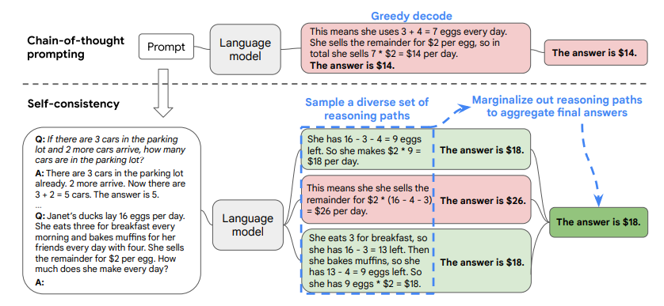
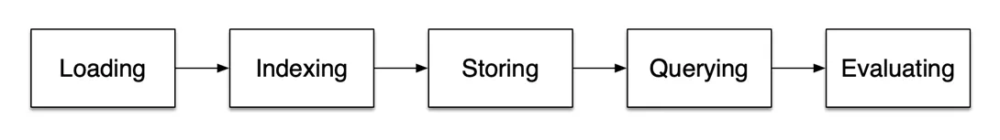
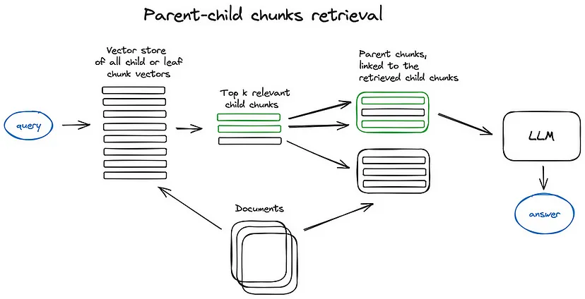

# **Langchain**

These models are trained on massive amounts of text data to learn patterns and entity relationships in the language. LLMs use deep learning algorithms to process and understand natural language, performing tasks such as translating, analyzing sentiments, and generating new text.


## **TABLE OF CONTENT**

**1.** [**Introduction to Langchain**](#Introduction-to-Langchain)

**2.** [**Components**](#Components)

* [**Schema**](#Schema)
* [**Models**](#Models)
* [**Prompts**](#Prompts)
* [**Parsers**](#Parsers)
* [**Indexes**](#Indexes)

  - [**Document Loading**](#Document-Loading)   

  -  [**Documnet Splitting**](#Documnet-Splitting)  

  - [**Vectors and Embeddings**](#Vectors-and-Embeddings) 

  - [**Retrevial**](#retrevial)

* [**Memory**](#Memory)

  - [**Chat Message History**](#Chat-Message-History)

  - [**Conversation Buffer Memory**](#Conversation-Buffer-Memory)

  - [**Conversation Buffer Window Memory**](#Conversation-Buffer-Window-Memory)

  - [**Conversation Token Buffer Memory**](#Conversation-Token-Buffer-Memory)

  - [**Conversation Summary Memory**](#Conversation-Summary-Memory)

  - [**Knowledge Graph Memory**](#Knowledge-Graph-Memory)

  - [**Entity Memory**](#Entity-Memory)

* [**Chains**](#Chains)
* [**Agents**](#Agents)

**3.** [**Embeddings**](#Embeddings)

**4.** [**Chain of Thought**](#Chain-of-Thought)

**5.** [**Retriever Augmented Generator**](#Retriever-Augmented-Generator)

**6.** [**Advanced Retrieval Techniques**](#Advanced-Retrieval-Techniques)

**7.** [**References**](#References)

---

## **Introduction to Langchain**

* Langchain is an open-source framework that equips developers with the necessary tools to create applications powered by large language models (LLMs). Langchain is similar to Lego blocks for LLMs; you can use multiple models for various behaviors for different tasks without having to learn each one from scratch, and then you can create pipelines using Langchain speed un application development.


  1. [**Evolve**](#Evolve)
  2. [**Why do we need Langchain?**](#Why-do-we-need-Langchain?)

---

### **Evolve**

* The journey of LangChain began as an ambitious project to overcome the limitations of early language models. Its evolution is marked by significant milestones that reflect the rapid advancement of AI and NLP technologies. Initially, language models were constrained by simplistic rule-based systems that lacked the ability to understand context or generate natural-sounding text. As machine learning and deep learning techniques matured, the foundation for LangChain was set.

* The advancements in transfer learning further propelled LangChain, making it possible to fine-tune models on specific datasets. This adaptability made LangChain a versatile tool for developers in various fields.

* The integration of modular components for specialized linguistic tasks expanded LangChain’s capabilities. Developers could extend LangChain’s functionality by adding or removing modules tailored to their needs, such as sentiment analysis, language translation, and more.

* Throughout its history, LangChain has placed a significant focus on context retention. Early language models struggled to maintain context over extended conversations, but LangChain introduced advanced memory mechanisms, allowing it to remember and reference past interactions, thereby creating more natural and engaging dialogues.

* Today, LangChain stands as a testament to the progress in AI conversational systems. With each update and refinement, it has become more sophisticated, more intuitive, and more capable of delivering experiences that closely mimic human interaction. It’s a story of continual improvement and innovation, with the promise of further advancements as the AI field evolves.

* LangChain’s ongoing development is driven by a community of researchers, developers, and enthusiasts who are relentlessly pushing the boundaries of what’s possible in AI. As we look back at its brief but impactful history, it is clear that LangChain is not just following the trends in AI development—it is setting them, paving the way for a future where conversational AI becomes an integral part of our daily lives. It’s exciting to think about what the future holds for LangChain and AI in general!

---

### **Why do we need Langchain?**

* Most of the LLMs(OpenAi, Al 21 Labs, LLaMA...) are not up to date

* They are not good at Domain Knowledge and fail when working with Proprietary data

* Working with different LLMs may become a tedious task

* **Autonomous agents:** LangChain can be used to create autonomous agents that can write code, run tests, and deploy applications using natural language commands. This is particularly useful for automating repetitive tasks and improving productivity.

* **Agent simulations:** LangChain can be used to simulate the behavior and interactions of multiple agents in a sandbox environment. This can be used to test the long-term memory and social skills of language models or explore how they react to different events or scenarios.

* **Personal assistants:** LangChain can be used to create personal assistants that can access and manipulate user data, remember user preferences and history, and perform various tasks such as booking flights, ordering food, or sending emails. This can greatly enhance the user experience and make interactions with technology more natural and intuitive.

* **Question answering:** LangChain can be used to create question-answering applications that can extract relevant information from text, images, audio, or video files, and provide concise and accurate answers to user queries. This can be particularly useful in fields like customer service, where quick and accurate responses are crucial.

---

## **Components**

1. [**Schema**](#Schema)

2. [**Models**](#Models)

3. [**Prompts**](#Prompts)

4. [**Parsers**](#Parsers)

5. [**Indexes**](#Indexes)

    * [**Document Loading**](#Document-Loading)

    * [**Documnet Splitting**](#Documnet-Splitting)

    * [**Vectors and Embeddings**](#Vectors-and-Embeddings)

    * [**Retrevial**](#retrevial)

6. [**Memory**](#Memory)

    * [**Chat Message History**](#Chat-Message-History)

    * [**Conversation Buffer Memory**](#Conversation-Buffer-Memory)

    * [**Conversation Buffer Window Memory**](#Conversation-Buffer-Window-Memory)

    * [**Conversation Token Buffer Memory**](#Conversation-Token-Buffer-Memory)

    * [**Conversation Summary Memory**](#Conversation-Summary-Memory)

    * [**Knowledge Graph Memory**](#Knowledge-Graph-Memory)

    * [**Entity Memory**](#Entity-Memory)

7. [**Chains**](#Chains)

8. [**Agents**](#Agents)

9. [**Embeddings**](#Embeddings)


---

### **Schema**

* The schema in LangChain can be defined using various techniques and languages, depending on the specific requirements and technologies used in the project. Commonly used schema definition languages include SQL (Structured Query Language), JSON (JavaScript Object Notation), and YAML (YAML Ain’t Markup Language).

* By defining a clear and consistent schema, LangChain ensures that data is organized and standardized, facilitating efficient data retrieval and manipulation. This is crucial for the performance and reliability of applications built with LangChain. It also ensures compatibility and interoperability between different components, making it easier for developers to build and manage their applications.

**EXAMPLE**

```python
import promptlayer
import os
os.environ["PROMPTLAYER_API_KEY"] = "<your-api-key>"
```

This section imports the promptlayer library and sets the environment variable PROMPTLAYER_API_KEY to your API key. This API key is required for using the PromptLayer service, which provides an interface for interacting with language models.

```python
#from langchain.schema import (HumanMessage,SystemMessage,AIMessage)
#from langchain_community.chat_models.huggingface import ChatHuggingFace
from langchain.chat_models import PromptLayerChatOpenAI
from langchain.schema import (SystemMessage,HumanMessage,AIMessage)

messages = [
    SystemMessage(content="You're a helpful assistant"),
    HumanMessage(
        content="What happens when an unstoppable force meets an immovable object?"
    ),
]

chat = PromptLayerChatOpenAI(pl_tags=["langchain"])

chat([
 SystemMessage(content="You are a helpful assistant that translates English to French."),
 HumanMessage(content="Translate this sentence from English to French. I love programming.")
])

chat = PromptLayerChatOpenAI(temperature=0.1)

# multiple sets of messages using .generate.
batch_messages = [
    [
        SystemMessage(content="You are a helpful assistant that translates English to French."),
        HumanMessage(content="I love programming.")
    ],
    [
        SystemMessage(content="You are a helpful assistant that translates English to French."),
        HumanMessage(content="I love artificial intelligence.")
    ],
]

result = chat.generate(batch_messages)
print(result)

chat([HumanMessage(content="Translate this sentence from English to tamil. I love programming.")])
```

* These lines are commented out but suggest importing various components from the LangChain library, such as message schemas and chat models. However, it seems they are not used in the subsequent code.

* Here, a list of messages is created, consisting of a system message and a human message. The system message appears to set the context, while the human message poses a question.

* An instance of PromptLayerChatOpenAI is created, specifying the tags "langchain". This class likely facilitates interactions with the PromptLayer service using OpenAI's API.

* This block of code initiates a chat interaction by providing a list of messages to the chat instance. The system message sets the context, and the human message poses a translation task from English to French.

* A new instance of `PromptLayerChatOpenAI` is created, this time setting the temperature parameter to 0.1. Temperature is a parameter that controls the randomness of the language model's responses during generation.

* A list of multiple sets of messages is created, each containing a system message and a human message. These sets of messages are intended to be used in a batch for generating responses.

* The `generate` method of the chat instance is called with the batch messages as input. This method likely generates responses for each set of messages in the batch and returns the results. The results are then printed.

* Another human message is sent to the chat instance, this time requesting translation from English to Tamil.

### **Models**

* models, such as GPT-4, are trained on vast amounts of text data and can generate human-like text based on the input they are given. They are the core of LangChain applications, enabling capabilities like natural language understanding and generation.

* LangChain provides a standard interface for interacting with these models, abstracting away many of the complexities involved in working directly with LLMs. This makes it easier for developers to build applications that leverage the power of these models.


**EXAMPLE**

**Loading Environment Variable**

```python
import promptlayer
import os
os.environ["PROMPTLAYER_API_KEY"] = "<your-api-key>"
```

Here, the code imports the `promptlayer` module and sets the environment variable `PROMPTLAYER_API_KEY` to a specific API key. This API key is likely used for accessing a service that provides language model capabilities.

**Setting Model Variable**

```python
# account for deprecation of LLM model
import datetime
# Get the current date
current_date = datetime.datetime.now().date()

# Set the model variable based on the current date
if current_date < datetime.date(2024,6,12):
    llm_model = "gpt-3.5-turbo"
else:
    llm_model = "gpt-3.5-turbo-0301"

print (llm_model)
```

This section determines which language model to use based on the current date. If the current date is before June 12, 2024, it sets the `llm_model` variable to "gpt-3.5-turbo". Otherwise, it sets it to "gpt-3.5-turbo-0301". This decision might be based on model updates or improvements.


**Defining Completion Function**

```python
def get_completion(prompt, model=llm_model):
    messages = [{"role": "user", "content": prompt}]
    response = PromptLayerChatOpenAI.ChatCompletion.create(
        model=model,
        messages=messages,
        temperature=0.1,
    )
    return response.choices[0].message["content"]
```

This function, `get_completion`, takes a prompt and an optional model name as input. It then uses the specified model to generate a completion for the provided prompt. The completion is generated with a low temperature parameter (0.1), which affects the randomness of the generated text.

---

### **Prompts**

A language model prompt is a user-provided set of instructions or input designed to guide the model's response. This aids the model in understanding the context and producing relevant output, whether it involves answering questions, completing sentences, or participating in a conversation


**EXAMPLE**

````python
customer_email = """
Arrr, I be fuming that me blender lid \
flew off and splattered me kitchen walls \
with smoothie! And to make matters worse,\
the warranty don't cover the cost of \
cleaning up me kitchen. I need yer help \
right now, matey!
"""
style = """American English \
in a Times New Roman and respectful tone
"""

prompt = f"""Translate the text \
that is delimited by triple backticks \
into a style that is {style}.
text: ```{customer_email}```
"""
````

This section defines a customer email and a desired style. Then, it constructs a prompt string that instructs the language model to translate the text within triple backticks to the specified style.

---

### **Parsers**

Output parsers are responsible for taking the output of an LLM and transforming it to a more suitable format. This is very useful when you are using LLMs to generate any form of structured data.

**EXAMPLE**

```python
# Output Parsers
print(prompt)
response = get_completion(prompt)
print(response)
```

Here, the prompt string is printed, and the `get_completion` function is called with the prompt as input. The generated completion is then printed.

**Hugging Face Integration**

````python
# Hugging Face Integration
from transformers import pipeline

def huggingface_completion(prompt, model_name="text-generation", max_length=100, **kwargs):
    # Load Hugging Face pipeline with max_length parameter
    huggingface_pipeline = pipeline(model_name, max_length=max_length, **kwargs)
    # Generate completion
    return huggingface_pipeline(prompt)

# Example usage
completion = huggingface_completion("Translate the text that is delimited by triple backticks into a style that is American English in a calm and respectful tone. text: ```Arrr, I be fuming that me blender lid flew off and splattered me kitchen walls with smoothie! And to make matters worse, the warranty don't cover the cost of cleaning up me kitchen. I need yer help right now, matey!```")

print(completion)
````

This part integrates with the Hugging Face pipeline for text generation. It defines a function huggingface_completion that takes a prompt and optional parameters, and returns a completion generated by the specified model. Finally, it demonstrates the usage of this function by generating a completion for a specific prompt and printing it.

---

### **Indexes**

* Indexes in the context of language models (LLMs) refer to structured representations of documents that facilitate efficient interaction with the documents. These indexes play a crucial role in the retrieval of relevant documents in response to user queries.

* Imagine you have a vast collection of text documents. Without indexes, searching through this collection for relevant information would be like looking for a needle in a haystack. Indexes help organize this information in a way that makes it easier for LLMs to quickly find and retrieve the most relevant documents based on a user's query.

* The primary use of indexes in chains is in the retrieval step. This involves taking a user's query and using the index to identify and return the most relevant documents. However, indexes can be used for other purposes besides retrieval, and retrieval itself can employ other methods besides indexes to find relevant documents.

* It's important to note that indexes are typically used for unstructured data, such as text documents. For structured data like SQL tables or APIs, different methods are employed.

* LangChain primarily supports indexes and retrieval mechanisms centered around vector databases. These databases store documents as vectors, which enables efficient searching and retrieval based on similarities between vectors.

  * **Document Loading:** This is the first step where the raw data (documents) are loaded into the system. The documents could be in various formats such as text files, PDFs, HTML, etc. 
  * **Document Splitting:** Once the documents are loaded, they are split into smaller chunks or segments. This is done to make the data more manageable and to improve the efficiency of the subsequent steps.
  * **Vectors and Embeddings:** Each chunk of data is then transformed into a vector representation, also known as an embedding. These embeddings capture the semantic meaning of the data and are used for efficient retrieval of relevant information. LangChain primarily supports indexes and retrieval mechanisms centered around vector databases.
  * **Retrieval:** This is the final step where a user’s query is taken and the system uses the index to identify and return the most relevant documents. The retrieval is based on the similarity between the query vector and the document vectors.


---

#### **Document Loading**

**Loading Environment Variable**

```python
from secret_key import hugging_facehub_key
import os
os.environ['HUGGINGFACEHUB_API_TOKEN'] = hugging_facehub_key
```

---

##### **PDF**

Load PDF using `pypdf` into array of documents, where each document contains the page content and metadata with `page` number

**Module Imports**

```python
from langchain.document_loaders import PyPDFLoader
from langchain import HuggingFaceHub
```

* `PyPDFLoader:` A module from LangChain used for loading PDF documents.

* `HuggingFaceHub:` A module from LangChain used for accessing pre-trained language models from the Hugging Face model hub.

**PDF Loading**

```python
# Load PDF
loader = PyPDFLoader("MachineLearning-Lecture01.pdf")
pages = loader.load()
```

* `loader: `An instance of ``PyPDFLoader`` initialized with the PDF file `"MachineLearning-Lecture01.pdf"`.

* `pages:` A list containing the extracted pages from the loaded PDF document.

**Summarizer Initialization**

```python
# Initialize summarizer
summarizer = HuggingFaceHub(
    repo_id="facebook/bart-large-cnn",
    model_kwargs={"temperature":0, "max_length":180}
)
```

* `summarizer:` An instance of `HuggingFaceHub` initialized with the BART-large model (`facebook/bart-large-cnn`) from the Hugging Face model hub.

* `model_kwargs:` Additional keyword arguments passed to the model during initialization, including `temperature` and `max_length`.

**Summarization Function**

```python
# Function to summarize text
def summarize(llm, text) -> str:
    return llm.invoke(f"Summarize this: {text}!")
```

`Summarizer:` A function that takes a language model (`llm`) and text as input and returns a summarized version of the text using the model.

`llm.invoke:` Invokes the language model to generate a summary of the provided text.

**Page Summarization**

```python
# Summarize page 10
page = pages[10]
summary = summarize(summarizer, page.page_content)
print(summary)
print(summarize)
```

* `page:` Retrieves the content of the 10th page from the extracted pages.

* `summary:` Generates a summary of the content of the 10th page using the `summarize` function and the initialized `summarizer`.

* `print(summary):` Prints the generated summary.

* `print(summarizer):` (Assuming this was intended to be `print(summarizer)`) Prints the `summarizer` object, which might have been unintentional.

---

##### **youtube**

**Install required packages**

```python
# ! pip install yt_dlp
# ! pip install pydub
# ! pip install openai
```

These lines are comments indicating that you need to install specific packages (`yt_dlp`, `pydub`, and `openai`). You can install them using pip if you haven't already done so.

```python
from langchain.document_loaders.generic import GenericLoader
from langchain.document_loaders.parsers import OpenAIWhisperParser
from langchain.document_loaders.blob_loaders.youtube_audio import YoutubeAudioLoader

# Define the YouTube video URL
url = "https://www.youtube.com/watch?v=jGwO_UgTS7I"
# Define the directory to save the downloaded content
save_dir = "../docs/youtube/"
# Initialize the loader with YouTubeAudioLoader and OpenAIWhisperParser
loader = GenericLoader(
    YoutubeAudioLoader([url], save_dir),
    OpenAIWhisperParser()
)
docs = loader.load()

content = docs[0].page_content[:500]

# Assuming 'summarizer' is an instantiated summarization model
# You can summarize the content using it
summary = summarize(summarizer, docs)

# Print the content and summary
print("Content:", content)
print("Summary:", summary)
```

* Here, we import necessary modules from LangChain for loading documents from various sources. Specifically, we import `GenericLoader` for loading documents, `OpenAIWhisperParser` for parsing text, and `YoutubeAudioLoader` for loading audio from YouTube.

* These lines define the YouTube video URL and the directory to save the downloaded content from the video.

* Here, we initialize the document loader with `YoutubeAudioLoader` for loading audio content from the specified URL and `OpenAIWhisperParser` for parsing the audio content.

* We load the documents using the initialized loader, which downloads the audio content from the YouTube video, transcribes it, and parses it into documents.

* We extract the content from the first document and select the first 500 characters to display as an example.

* Here, assuming `summarizer` is an instantiated summarization model (like the one initialized previously), we use it to summarizer the loaded documents.

---

##### **URL`s**

```python
from langchain.document_loaders import WebBaseLoader

# Initialize the WebBaseLoader with the URL
loader = WebBaseLoader("https://github.com/tamaraiselva/git-demo/blob/main/metriales.docx")

# Load documents
docs = loader.load()

# Get the content of the first document
content = docs[0].page_content[:500]

# Assuming 'summarizer' is an instantiated summarization model
# You can summarize the content using it
summary = summarize(summarizer, docs)

# Print the content and summary
print("Content:", content)
print("Summary:", summary)
```

* This line imports the `WebBaseLoader` from LangChain, which is used to load documents from a web URL.

* Here, we initialize a `WebBaseLoader` object with the URL of a document hosted on the web. This loader will fetch the document from the specified URL.

* This line loads the document(s) using the initialized loader.

* We retrieve the content of the first document loaded. In this case, we only take the first 500 characters of the content for demonstration purposes.

* Here, we summarize the content of the document(s) using a pre-instantiated summarization model named `summarizer`. However, there seems to be a slight issue here. The `summarize` function expects a single document's content, but we're passing the entire list of documents. It should likely be `summary = summarize(summarizer, content)` instead.

* Finally, we print the content of the document and its summary for inspection.

---

##### **NOTION**

* This line imports the `NotionDirectoryLoader` class from the `document_loaders` module in the LangChain framework. This loader is specifically designed to load documents from a directory containing Notion-exported Markdown files.

```python
from langchain.document_loaders import NotionDirectoryLoader

loader = NotionDirectoryLoader("notion")
docs = loader.load()

if docs:
    print(docs[0].page_content[0:100])
    print(docs[0].metadata)
else:
    print("No Notion documents were loaded.")
```

* Here, we create an instance of the `NotionDirectoryLoader` class and provide the path to the directory where Notion-exported Markdown files are located. In this case, the directory is named "notion".

* We use the `load()` method of the `loader` instance to load the documents from the specified directory. This method returns a list of `Document` objects representing the loaded documents.

* This conditional statement checks if any documents were loaded. If there are documents, it prints the first 100 characters of the content of the first document (`docs[0].page_content[0:100]`) and the metadata of the first document (`docs[0].metadata`). If no documents were loaded, it prints a message indicating that no Notion documents were loaded.

---

#### **Documnet Splitting**

**Loading Environment Variable**

```python
from secret_key import hugging_facehub_key
import os
os.environ['HUGGINGFACEHUB_API_TOKEN'] = hugging_facehub_key
```

**Text Splitting**

Here, we import the `CharacterTextSplitter` module from LangChain. This module provides functionality to split text into smaller chunks based on characters.

```python
from langchain.text_splitter import CharacterTextSplitter

chunk_size =26
chunk_overlap = 4

# Initialize the CharacterTextSplitter
c_splitter = CharacterTextSplitter(
    chunk_size=chunk_size,
    chunk_overlap=chunk_overlap,
    separator=' '  # Optional, if you want to split by a separator
)

# Define the text
text = 'abcdefghijklmnopqrstuvwxyzabcdefg'

# Split the text using the CharacterTextSplitter
chunks = c_splitter.split_text(text)

print(chunks)
```

* We define the parameters for text splitting.` chunk_size` specifies the maximum length of each chunk, and `chunk_overlap` specifies how much overlap there should be between adjacent chunks.

* We create an instance of `CharacterTextSplitter` and initialize it with the specified parameters. Optionally, you can specify a `separator` if you want to split the text based on a particular character or string.

* We define the text that we want to split into smaller chunks.

* We use the `split_text()` method of the `CharacterTextSplitter` instance to split the text into smaller chunks based on the specified parameters

* Finally, we print the resulting chunks.

**Recursive splitting details**

**`Using RecursiveCharacterTextSplitter:`**

```python
from langchain.text_splitter import RecursiveCharacterTextSplitter, CharacterTextSplitter
from langchain.document_loaders import PyPDFLoader, NotionDirectoryLoader

r_splitter = RecursiveCharacterTextSplitter(
    chunk_size=chunk_size,
    chunk_overlap=chunk_overlap,
    separators=["\n\n", "\n", " ", ""]
)
```

- `Purpose:` This initializes a text splitter that recursively splits text into chunks based on defined parameters.

- `Parameters:`

  * `chunk_size:` The maximum size of each chunk in characters.

  * `chunk_overlap:` The overlap between consecutive chunks (in characters).

  * `separators:` List of strings that define separators used for splitting the text. Empty strings represent no separation.

- `Usage:` Useful for splitting long pieces of text into manageable chunks for processing.


**`Using CharacterTextSplitter:`**

```python
c_splitter = CharacterTextSplitter(
    separator="\n",
    chunk_size=1000,
    chunk_overlap=150
)
```

- `Purpose:` This initializes a text splitter that splits text into chunks based on a single separator.

- `Parameters:`

  * `separator:` The string used to split the text into chunks.

  * `chunk_size:` The maximum size of each chunk in characters.

  * `chunk_overlap:` The overlap between consecutive chunks (in characters).

- `Usage:` Suitable for simpler text splitting tasks where a single separator suffices.

**`Using PyPDFLoader`**

```python
loader = PyPDFLoader("path_to_pdf_file")
pages = loader.load()
```

- `Purpose:` This loads a PDF document and extracts its pages.

- `Parameters:`

  * `"path_to_pdf_file":` The path to the PDF file.

- `Returns:` A list of page objects representing the contents of each page in the PDF.

**`Using NotionDirectoryLoader:`**

```python
loader = NotionDirectoryLoader("directory_path")
pages = loader.load()
```

- `Purpose:` This loads documents from a directory, assuming they are stored in Notion's format.

- `Parameters:`

  * `"directory_path":` The path to the directory containing Notion documents.

- `Returns:` A list of document objects representing the contents of each document in the directory.

**`Splitting Documents`**

```python
docs = c_splitter.split_documents(pages)
```

- `Purpose:` This splits loaded documents into chunks using the defined text splitter.

- `Parameters:`

  * `pages:` The list of document objects to be split.

- `Returns:` A list of document chunks, each representing a portion of the original document.

---

#### **Vectors and Embeddings**

**Embeddings**

LangChain Embeddings are numerical representations of text data, designed to be fed into machine learning algorithms. These embeddings are crucial for a variety of natural language processing (NLP) tasks, such as sentiment analysis, text classification, and language translation.


```python
# !pip install sentence-transformers
from langchain.embeddings import OpenAIEmbeddings, HuggingFaceEmbeddings

embeddings = HuggingFaceEmbeddings()

text = "This is a test document to check the embeddings."
text_embedding = embeddings.embed_query(text)

print(f'Embeddings lenght: {len(text_embedding)}')
print (f"Here's a sample: {text_embedding[:5]}...")
```

* This line is a comment indicating that you should install the sentence-transformers package if you haven't already. It's likely included as a reminder in case the package isn't installed in your environment.

* Here, we import two different types of embedding models from LangChain: `OpenAIEmbeddings` and `HuggingFaceEmbeddings`. These models are used to generate embeddings for text.

* We initialize an embedding model using`HuggingFaceEmbeddings()`. This creates an instance of the Hugging Face embedding model.

* We define a sample text that we want to generate embeddings for.

* We use the initialized embedding model (`embeddings`) to generate embeddings for the given text (`text`) using the `embed_query()` method.

* We print the length of the embeddings generated for the text and show a sample of the embeddings. The length indicates the dimensionality of the embeddings, and the sample provides a glimpse of the first few values of the embeddings.

**Vectorstore**

VectorStore is a component of LangChain that facilitates efficient storage and retrieval of document embeddings, which are vector representations of documents. These embeddings are created using language models and are valuable for various natural language processing tasks such as information retrieval and document similarity analysis.


**Installation:**

To install VectorStore, you can use pip:

```python
# ! pip install langchain-chroma
from langchain_chroma import Chroma

db = Chroma.from_documents(splits, embeddings)

print(db._collection.count())
```

* First, import the Chroma class from langchain_chroma module.

* Then, create a VectorStore instance using the from_documents method. This method requires two parameters:

  * ` splits: `A list of document splits, where each split represents a document.

  * `embeddings:` A list of embeddings corresponding to the document splits.

* Finally, you can access the number of documents stored in the VectorStore using the count() method on the _collection attribute.

---

#### **Retrevial**

**Vectorstore retrieval**

```python
# !pip install lark
# !pip install pypdf tiktoken faiss-cpu

from langchain.document_loaders import PyPDFLoader
from langchain.text_splitter import CharacterTextSplitter, RecursiveCharacterTextSplitter
from langchain.vectorstores import FAISS
from langchain.embeddings import HuggingFaceEmbeddings

loader = PyPDFLoader("MachineLearning-Lecture01.pdf")
documents = loader.load()

text_splitter = CharacterTextSplitter(chunk_size=1000, chunk_overlap=0)
texts = text_splitter.split_documents(documents)

# Initialize the HuggingFaceEmbeddings
embeddings = HuggingFaceEmbeddings()
db = FAISS.from_documents(texts, embeddings)

# You can also specify search kwargs like k to use when doing retrieval.
#retriever = db.as_retriever()
retriever = db.as_retriever(search_kwargs={"k": 2})

print(len(documents))
```

* This code block is commented out, but it suggests installing necessary packages using pip. However, since it's commented out, it doesn't affect the execution of the code. These packages seem to be dependencies for LangChain.

* These lines import necessary modules from LangChain for document loading (`PyPDFLoader`), text splitting (`CharacterTextSplitter`, `RecursiveCharacterTextSplitter`), vector stores (`FAISS`), and embeddings (`HuggingFaceEmbeddings`).

* Here, a `PyPDFLoader` instance is created to load a PDF document named "MachineLearning-Lecture01.pdf". The `load()` method is then used to extract the content of the document into a list of documents.

* A `CharacterTextSplitter` instance is created with specified parameters for chunk size and overlap. Then, the `split_documents()` method is used to split the documents into smaller text chunks based on the specified parameters.

* An instance of `HuggingFaceEmbeddings` is initialized. Then, a FAISS vector store (`FAISS`) is created from the text chunks using the embeddings obtained from the Hugging Face model.

* A retriever object is created from the FAISS vector store. Additional search arguments, such as the number of nearest neighbors (`k`), can be specified.

* This line prints the number of documents loaded from the PDF file.

---

### **Memory**

Memory which is still in beta phase is an essential component in a conversation. This allows us to infer information in past conversations. Users have various options, including preserving the complete history of all conversations, summarizing the ongoing conversation, or retaining the most recent n exchanges.


**Loading Environment Variable**

```python
from secret_key import hugging_facehub_key
import os
os.environ['HUGGINGFACEHUB_API_TOKEN'] = hugging_facehub_key
```

**Models**

```python
import datetime
current_date = datetime.datetime.now().date()
if current_date < datetime.date(2024,5,5):
    llm_name = "gpt-3.5-turbo-0301"
else:
    llm_name = "gpt-3.5-turbo"
print(llm_name)
```

#### **Chat Message History**

```python
from langchain.memory import ChatMessageHistory
from langchain import PromptTemplate, LLMChain

# Initialize chat message history
history = ChatMessageHistory()

# Add user and AI messages to the history
history.add_user_message("hi!")
history.add_ai_message("whats up?")

# Print the current messages in the history
print(history.messages)

# Add another user message and print the updated history
history.add_user_message("Fine, what about you?")
print(history.messages)

# Define a prompt template with a question variable
template = """Question: {question}

Answer: Let's think step by step."""
prompt = PromptTemplate(template=template, input_variables=["question"])

# Create an LLMChain with the prompt template and a language model
# Note: 'llm' should be initialized before using it here
llm_chain = LLMChain(prompt=prompt, llm=llm)

# Define a question and run the chain to get the model's response
question = "Which city does the company's headquarters for our international employees reside in?"
print(llm_chain.run(question))
```

* This code block imports necessary modules from LangChain for managing chat message history (`ChatMessageHistory`), creating prompt templates (`PromptTemplate`), and executing language model chains (`LLMChain`).

* An instance of `ChatMessageHistory` is initialized to manage the chat message history.

* We add a message from the user to the chat history with the content "hi!". 

* We add a message from the AI to the chat history with the content "whats up?".

* We print the current messages in the chat history.

* We add another message from the user to the chat history with the content "Fine, what about you?" and then display the updated chat messages.

* We define a template for prompting the language model. The template includes a placeholder {*question*} for the user's question and a fixed part "Answer: Let's think step by step." to guide the model's response.

* We create a `PromptTemplate` instance using the defined template. The `input_variables` parameter specifies that the template expects a variable named `question`.

* We create an `LLMChain` instance using the `prompt` and a language model instance `llm`. This chain will use the prompt template to generate responses based on the input question.

* We define a question to be asked to the language model: "Which city does the company's headquarters for our international employees reside in?" and use the `llm_chain` to generate and print the model's response.

---

#### **Conversation Buffer Memory**

* This method involves stacking all user-agent interactions into the prompt, allowing the model to track the entire conversation. However, it poses limitations in handling long conversations due to token span constraints.

```python
from langchain.chains import ConversationChain
from langchain.memory import ConversationBufferMemory

memory = ConversationBufferMemory()
conversation = ConversationChain(
    llm=llm, 
    memory = memory,
    verbose=True
)

conversation.predict(input="Hi, my name is ram")
conversation.predict(input="What is 1+1?")
conversation.predict(input="What is my name?")
print(memory.buffer)
memory.load_memory_variables({})
memory = ConversationBufferMemory()
memory.save_context({"input": "Hi"}, 
                    {"output": "What's up"})
print(memory.buffer)
memory.load_memory_variables({})
memory.save_context({"input": "Not much, just hanging"}, 
                    {"output": "Cool"})
memory.load_memory_variables({})
```

1. **Importing Necessary Modules**

    * Here, we import modules required for setting up a conversation chain and managing conversation memory.

2. **Setting up Conversation Memory**

    * This line initializes a conversation memory buffer, which will store the context and history of the conversation.

3. **Creating a Conversation Chain**

    * A conversation chain is created, which uses a language model (llm) and the initialized conversation memory buffer. Setting verbose=True enables verbose mode, providing additional information during conversation processing

4. **Interacting with the Conversation Chain**

    * These lines simulate a conversation by providing inputs to the conversation chain. Each input triggers a response from the language model based on the conversation context.

5. **Accessing Conversation Memory**

    * This line prints the current content of the conversation memory buffer, which includes the conversation history and context.

6. **Managing Conversation Memory**

    * These lines demonstrate managing conversation memory. `load_memory_variables({})` clears the memory buffer, while `ConversationBufferMemory()` creates a new instance of the conversation memory.

    * These lines save and load conversation context into the memory buffer **save_context()** stores input-output pairs in the memory, while **load_memory_variables({})** resets the memory variables.

---

#### **Conversation Buffer Window Memory**

* This approach limits the memory to the last few interactions, addressing token constraints while still retaining recent context. It's a compromise between full conversation tracking and token efficiency.

```python
from langchain.memory import ConversationBufferWindowMemory

# Initialize ConversationBufferWindowMemory with k=1
memory = ConversationBufferWindowMemory(k=1)

# Save conversation contexts
memory.save_context({"input": "Hi"},
                    {"output": "What's up"})
memory.save_context({"input": "Not much, just hanging"},
                    {"output": "Cool"})

# Load memory variables (optional)
memory.load_memory_variables({})

# Reinitialize memory (optional, seems redundant)
memory = ConversationBufferWindowMemory(k=1)

# Create ConversationChain object
conversation = ConversationChain(
    llm=llm, 
    memory=memory,
    verbose=False
)

# Predict responses to inputs
conversation.predict(input="Hi, my name is ram")
conversation.predict(input="What is 1+1?")
conversation.predict(input="What is my name?")
```

* We import the ConversationBufferWindowMemory class from the LangChain library. This class represents a memory module that stores conversation contexts.

* We initialize a ConversationBufferWindowMemory instance with a window size of 1 (k=1). This means that the memory will retain the most recent conversation context.

* We save two conversation contexts into the memory. Each context consists of an input and an output.

* We load memory variables, although it appears to be redundant in this context as no additional parameters are provided.

* This line reinitializes the memory object with the same parameters as before. However, it seems redundant since the memory was already initialized earlier.

* We create a `ConversationChain` object, passing in a language model (`llm`), the initialized memory object, and setting verbose to False.

* We predict responses to three different inputs using the `ConversationChain` object. Each input represents a message in a conversation.

---

#### **Conversation Token Buffer Memory**

```python
#!pip install tiktoken
from langchain.memory import ConversationTokenBufferMemory
# Initialize memory
memory = ConversationTokenBufferMemory(llm=llm, max_token_limit=50)

# Save contexts
memory.save_context({"input": "AI is what?!"}, {"output": "Amazing!"})
memory.save_context({"input": "Backpropagation is what?"}, {"output": "Beautiful!"})
memory.save_context({"input": "Chatbots are what?"}, {"output": "Charming!"})

# Load memory variables
memory.load_memory_variables({})

```

* `Installation:` First, ensure you have the tiktoken library installed by running !pip install tiktoken.

* `Importing Modules:` Import the necessary module from LangChain:

    * This imports the ConversationTokenBufferMemory class, which is used to manage conversation tokens in a buffer memory.

* `Initializing Memory:` Create an instance of `ConversationTokenBufferMemory`:

    * Initialize the memory object with the language model (llm) and a maximum token limit of 50.

* `Saving Contexts:` Save conversation contexts into the memory:

  * Each `save_context` call saves an input-output pair into the memory. For example, the input "AI is what?!" corresponds to the output "Amazing!".

* `Loading Memory Variables:` Load memory variables to reset the memory:

  * Each save_context call saves an input-output pair into the memory. For example, the input "AI is what?!" corresponds to the output "Amazing!". 

* To document this code for clarity:

  * `Purpose:` The code manages conversation tokens in a buffer memory, allowing the storage and retrieval of input-output pairs.

  * `Initialization:` The ConversationTokenBufferMemory class is initialized with a language model and a maximum token limit.

  * **Functionality:**

    * `Saving Contexts:` Saves input-output pairs into the memory.

    * `oad_memory_variables:` Loads memory variables, potentially for configuration or additional data.

---

#### **Conversation Summary Memory**

* This method summarizes the conversation at each step, reducing token usage but maintaining context. It provides a balance between retaining conversation history and token efficiency.

```python
from langchain.memory import ConversationSummaryBufferMemory
# create a long string
schedule = "There is a meeting at 8am with your product team. \
You will need your powerpoint presentation prepared. \
9am-12pm have time to work on your LangChain \
project which will go quickly because Langchain is such a powerful tool. \
At Noon, lunch at the italian resturant with a customer who is driving \
from over an hour away to meet you to understand the latest in AI. \
Be sure to bring your laptop to show the latest LLM demo."

memory = ConversationSummaryBufferMemory(llm=llm, max_token_limit=100)
memory.save_context({"input": "Hello"}, {"output": "What's up"})
memory.save_context({"input": "Not much, just hanging"},
                    {"output": "Cool"})
memory.save_context({"input": "What is on the schedule today?"}, 
                    {"output": f"{schedule}"})
memory.load_memory_variables({})
conversation = ConversationChain(
    llm=llm, 
    memory = memory,
    verbose=True
)
conversation.predict(input="What would be a good demo to show?")
memory.load_memory_variables({})
```

* We import the `ConversationSummaryBufferMemory` class from the LangChain memory module. This class allows us to store and manage conversational context and summaries.

* We create a long string named `schedule` that contains a detailed schedule for the day, including meetings, work on a project, lunch plans, and more.

* We initialize a `ConversationSummaryBufferMemory` object named `memory`. This object will store conversational context and summaries. We pass the language model (`llm`) and a maximum token limit (`max_token_limit`) as parameters.

* We save conversational contexts and their corresponding summaries into the memory object. Each context consists of an input (what was said in the conversation) and an output (the summary or response). Here, we save three different conversational contexts and their corresponding summaries.

* We load the memory variables into the memory object. This step ensures that the memory is ready for use in the conversation chain.

* We create a `ConversationChain` object named `conversation` that uses the language model (`llm`) and the initialized memory object. The `verbose=True` parameter enables verbose mode for additional information during conversation processing.

* We predict a response to the input "What would be a good demo to show?" using the `ConversationChain` object. This input triggers the model to generate a response based on the conversation context and the stored summaries.

---

#### **Knowledge Graph Memory**

* Utilizes a KG structure to extract relevant information from the conversation, organizing it into entities and relationships. It enhances contextual understanding and facilitates downstream tasks.

```python
from langchain.memory import ConversationKGMemory
from langchain.memory import ConversationBufferWindowMemory
from langchain import HuggingFaceHub
import networkx as nx
import matplotlib.pyplot as plt

memory = ConversationBufferWindowMemory(k=1)  

# Define LLM
repo_id = "google/flan-t5-large"
llm = HuggingFaceHub(
    repo_id=repo_id, model_kwargs={"temperature": 0.5, "max_length": 64}
)

template = """The following is a friendly conversation between a human and an AI. The AI is talkative and provides lots of specific details from its context. 
If the AI does not know the answer to a question, it truthfully says it does not know. The AI ONLY uses information contained in the "Relevant Information" section and does not hallucinate.

Relevant Information:

{history}

Conversation:
Human: {input}
AI:"""
prompt = PromptTemplate(input_variables=["history", "input"], template=template)

conversation_with_kg = ConversationChain(
    llm=llm, 
    verbose=True, 
    prompt=prompt,
    memory=ConversationKGMemory(llm=llm)
)


conversation_with_kg.predict(input="Hi there! I am Sam")
conversation_with_kg.predict(input="My TV is broken and I need some customer assistance")
conversation_with_kg.predict(input="Yes it is and it is still under warranty. my warranty number is A512423")

# nx.draw(conversation_with_kg.memory.kg, with_labels=True)
# plt.show()

print(conversation_with_kg.memory.kg)
print(conversation_with_kg.memory.kg.get_triples())
```

**1. Importing Required Modules**

* We import necessary modules from LangChain for memory management and Hugging Face integration, as well as NetworkX and Matplotlib for handling and visualizing the knowledge graph.

**2. Setting Up the Language Model**

* We define a language model (LLM) using the `google/flan-t5-large` model from Hugging Face. Model-specific parameters like `temperature` and `max_length` are also specified.

**3. Creating the Prompt Template**


* We create a prompt template that guides the conversation between the human and the AI. The AI is instructed to use only the information provided in the "Relevant Information" section and avoid fabricating answers.

**4. Setting Up the Conversation Chain**

* We set up a conversation chain using the defined LLM, the prompt template, and a `ConversationKGMemory` for maintaining a knowledge graph memory.

**5. Running the Conversation**

* We simulate a conversation where the user interacts with the AI, providing different inputs. The AI uses the knowledge graph memory to maintain context and provide relevant responses.

**6. Visualizing the Knowledge Graph**

* This part of the code (commented out) is for visualizing the knowledge graph using NetworkX and Matplotlib. If uncommented, it would draw the graph and display it.

**7. Printing the Knowledge Graph and Its Triples**

* Finally, we print the knowledge graph object and its triples (relationships between entities) to see the structure of the knowledge graph.

---

#### **Entity Memory**

* Extracts specific entities mentioned in the conversation, such as names, numbers, or keywords, for further processing or response generation. It aids in understanding user intent and context.

```python
from langchain.memory import ConversationEntityMemory
from langchain.chains.conversation import ConversationChain
from langchain.chains.conversation.prompt import ENTITY_MEMORY_CONVERSATION_TEMPLATE
from langchain import HuggingFaceHub
from pprint import pprint

# Define LLM
repo_id = "google/flan-t5-large"  # The ID of the pre-trained model on Hugging Face
llm = HuggingFaceHub(
    repo_id=repo_id, model_kwargs={"temperature": 0.5, "max_length": 64}
)

# Initialize ConversationEntityMemory
memory = ConversationEntityMemory(llm=llm)

# Initialize ConversationChain
conversation = ConversationChain(
    llm=llm, 
    verbose=True,
    prompt=ENTITY_MEMORY_CONVERSATION_TEMPLATE,
    memory=memory
)

# Make predictions and interact with memory
conversation.predict(input="Hi I am Sam. My TV is broken but it is under warranty.")
conversation.predict(input="How can I get it fixed. The warranty number is A512453")

# Access the entity cache
conversation.memory.entity_cache

conversation.predict(input="Can you send the repair person call Dave to fix it?")
conversation.memory.entity_cache


# Pretty print the memory object
pprint(conversation.memory)
```

* We import the necessary modules and functions. `ConversationEntityMemory` and `ConversationChain` are used to manage and conduct conversations with entity memory. `ENTITY_MEMORY_CONVERSATION_TEMPLATE` is a predefined prompt template. `HuggingFaceHub` allows us to use a pre-trained model from Hugging Face, and `pprint` is used for pretty-printing objects for better readability.This code snippet demonstrates the use of the `ConversationEntityMemory` class in LangChain to manage entities and their relationships in a conversation.

* We define the language model (LLM) using the `HuggingFaceHub` class. We specify the model ID (`google/flan-t5-large`) and provide model-specific arguments (`temperature` and `max_length`). The `temperature` controls the randomness of the output, and `max_length` specifies the maximum length of the generated text.

* We initialize a `ConversationEntityMemory` object named `memory`. This memory object will store entities and their relationships during the conversation.

* We create a `ConversationChain` object named `conversation` that uses the language model (`llm`), enables verbose mode, specifies a predefined prompt template (`ENTITY_MEMORY_CONVERSATION_TEMPLATE`), and uses the initialized memory object.

* We simulate a conversation by providing inputs to the conversation chain. The AI responds based on the conversation context and the entity memory.

* We access the entity cache stored in the memory object to view the entities and their relationships at different points in the conversation.

* We pretty-print the memory object to display the entities and relationships stored in the entity cache.

---

### **Chains**

* Chains form the backbone of LangChain's workflows, seamlessly integrating Language Model Models (LLMs) with other components to build applications through the execution of a series of functions.

* The fundamental chain is the LLMChain, which straightforwardly invokes a model and a prompt template. For example, consider saving a prompt as "ExamplePrompt" and intending to run it with Flan-T5. By importing LLMChain from langchain.chains,

* `you can define a chain_example like so:` LLMChain(llm=flan-t5, prompt=ExamplePrompt). Executing the chain for a given input is as simple as calling chain_example.run("input").

* For scenarios where the output of one function needs to serve as the input for the next, SimpleSequentialChain comes into play. Each function within this chain can employ diverse prompts, tools, parameters, or even different models, catering to specific requirements.


> Chains are simple objects that essentially string together several components (for linear pipelines).

**EXAMPLE**

```python
from langchain import HuggingFaceHub
from langchain import PromptTemplate, LLMChain

# Article text
article = '''Coinbase, the second-largest crypto exchange by trading volume, released its Q4 2022 earnings on Tuesday, giving shareholders and market players alike an updated look into its financials. In response to the report, the company's shares are down modestly in early after-hours trading.In the fourth quarter of 2022, Coinbase generated 
2.49 billion in the year-ago quarter. Coin base's top line was not enough to cover its expenses: The company lost 
2.46 per share, and an adjusted EBITDA deficit of 
581.2 million in revenue and earnings per share of -
201.8 million driven by 8.4 million monthly transaction users (MTUs), according to data provided by Yahoo Finance.Before its Q4 earnings were released, Coinbase's stock had risen 86% year-to-date. Even with that rally, the value of Coinbase when measured on a per-share basis is still down significantly from its 52-week high of 
26 billion in the third quarter of last year to 
133 billion to 
1.5 trillion during 2022, which resulted in Coinbase's total trading volumes and transaction revenues to fall 50% and 66% year-over-year, respectively, the company reported.As you would expect with declines in trading volume, trading revenue at Coinbase fell in Q4 compared to the third quarter of last year, dipping from 
322.1 million. (TechCrunch is comparing Coinbase's Q4 2022 results to Q3 2022 instead of Q4 2021, as the latter comparison would be less useful given how much the crypto market has changed in the last year; we're all aware that overall crypto activity has fallen from the final months of 2021.)There were bits of good news in the Coinbase report. While Coinbase's trading revenues were less than exuberant, the company's other revenues posted gains. What Coinbase calls its "subscription and services revenue" rose from 
282.8 million in Q4 of the same year, a gain of just over 34% in a single quarter.And even as the crypto industry faced a number of catastrophic events, including the Terra/LUNA and FTX collapses to name a few, there was still growth in other areas. The monthly active developers in crypto have more than doubled since 2020 to over 20,000, while major brands like Starbucks, Nike and Adidas have dived into the space alongside social media platforms like Instagram and Reddit.With big players getting into crypto, industry players are hoping this move results in greater adoption both for product use cases and trading volumes. Although there was a lot of movement from traditional retail markets and Web 2.0 businesses, trading volume for both consumer and institutional users fell quarter-over-quarter for Coinbase.Looking forward, it'll be interesting to see if these pieces pick back up and trading interest reemerges in 2023, or if platforms like Coinbase will have to keep looking elsewhere for revenue (like its subscription service) if users continue to shy away from the market.
'''

# Create prompt for extracting facts
fact_extraction_prompt = PromptTemplate(
    input_variables=["text_input"],
    template="Extract the key facts out of this text. Don't include opinions. Give each fact a number and keep them short sentences. :\n\n {text_input}"
)

# Initialize fact extraction chain
fact_extraction_chain = LLMChain(llm=llm, prompt=fact_extraction_prompt)

# Extract facts
facts = fact_extraction_chain.run(article)
print(facts)

# Create prompt for investor update
investor_update_prompt = PromptTemplate(
    input_variables=["facts"],
    template="Write an investor update using these key facts:\n\n {facts}"
)

# Initialize investor update chain
investor_update_chain = LLMChain(llm=llm, prompt=investor_update_prompt)

# Generate investor update
investor_update = investor_update_chain.run(facts)
print(investor_update)

# Create prompt for knowledge graph triples
triples_prompt = PromptTemplate(
    input_variables=["facts"],
    template="Take the following list of facts and turn them into triples for a knowledge graph:\n\n {facts}"
)

# Initialize triples chain
triples_chain = LLMChain(llm=llm, prompt=triples_prompt)

# Generate triples
triples = triples_chain.run(facts)
print(triples)
```

* We import the necessary components from LangChain: HuggingFaceHub for accessing the language model, PromptTemplate for defining prompts, and LLMChain for creating chains of operations with the language model.

**1. Article Text**

* Here, we define a long article text about Coinbase's financial performance and developments in the crypto market.

**2. Fact Extraction Prompt**

* We create a prompt template for extracting key facts from the article text. The template instructs the model to extract facts without including opinions and present each fact as a numbered short sentence.

* We set up an LLMChain with the fact extraction prompt, which combines the language model (llm) with the prompt.

* We run the chain on the article to extract key facts, storing the result in the facts variable.

**3. Investor Update Prompt**

* Next, we define a prompt for generating an investor update using the extracted facts. We create another LLMChain with this prompt.

* We run the chain on the extracted facts to generate an investor update based on the key facts.

**4. Knowledge Graph Triples Prompt**

* We create a prompt template for converting the extracted facts into triples for a knowledge graph. The template instructs the model to transform the facts into structured triples.

* We run the triples chain using the extracted facts to generate knowledge graph triples.

**5. Print Results**

* Finally, we print the extracted facts, the generated investor update, and the knowledge graph triples to see the outputs of each step in the chain.

---

### **Agents**

* Agents, at their core, leverage a language model to make decisions about a sequence of actions to be taken. Unlike chains where a predefined sequence of actions is hard coded directly in the code, agents use a llm as a reasoning engine to determine the actions to be taken and their order.


  > Agents are more sophisticated, allowing business logic to let you choose how the components should interact

**EXAMPLE**

```python
# !pip install google-search-results
from langchain import HuggingFaceHub
from langchain.agents import initialize_agent, Tool
from langchain.agents import AgentType
```

Here, we import necessary modules from LangChain. We also install a Python package called google-search-results, which seems to be required but is commented out.

```python
llm_hf = HuggingFaceHub(repo_id="google/flan-t5-xl", model_kwargs={"temperature":0, "max_length":64})
llm =  PromptLayer(temperature=0)
search = HuggingFaceHub()
```

These lines initialize different language models using HuggingFaceHub and PromptLayer. The `llm_hf` model is initialized with the Google Flan T5 XL model, while the `llm` model is initialized with the PromptLayer model.

```python
tools = [
    Tool(
        name="Intermediate Answer",
        func=search.run,
        description="useful for when you need to ask with search"
    )
]
```

A list of tools is defined, with each tool containing a name, function, and description. In this case, the tool is named "Intermediate Answer" and uses the `search.run` function.

```python
self_ask_with_search = initialize_agent(tools, llm, agent=AgentType.SELF_ASK_WITH_SEARCH, verbose=True)
```

An agent named `self_ask_with_search` is initialized using the `initialize_agent` function. The agent uses the specified tools, language model (`llm`), and agent type (`AgentType.SELF_ASK_WITH_SEARCH`).

```python
self_ask_with_search.run("What is the hometown of the reigning men's French Open?")
```

We run the agent with a specific question as input. The agent will likely use its internal logic to provide an answer based on the question and the available tools.

```python
#if you want the intermediate answers, pass return_intermediate_steps=True.
self_ask_with_search = initialize_agent(tools, llm, agent=AgentType.SELF_ASK_WITH_SEARCH, return_intermediate_steps=True, verbose=True)
response = self_ask_with_search("What is the hometown of the reigning men's French Open?")

import json
print(json.dumps(response["intermediate_steps"], indent=2))
```

Here, we reinitialize the agent with an additional parameter `return_intermediate_steps=True`, which indicates that we want to capture intermediate steps during the agent's processing. Then, we run the agent again with the same question and print out the intermediate steps in a JSON format.

---

## **Embeddings**

* Simply put, text embeddings are a method of translating words or sentences from human language into the language of computers — numbers. This numerical representation of text allows machines to understand and process language meaningfully, enabling many of the advanced NLP applications we use today.


**Step 1: Using Hugging Face Transformers to Embed Sentences**

* First, we utilize the transformers library from Hugging Face to embed sentences using a pre-trained BERT model.

**1. Load the tokenizer and model:**

```python
from transformers import AutoTokenizer, AutoModel
import torch

# Choose a pre-trained model
model_name = 'bert-base-uncased'

# Load the tokenizer and model
tokenizer = AutoTokenizer.from_pretrained(model_name)
model = AutoModel.from_pretrained(model_name)
```

**2. Define sentences and tokenize them:**

```python
# Define the sentences you want to embed
sentences = ["This is a sample sentence.", "This is another example."]

# Tokenize the sentences
inputs = tokenizer(sentences, return_tensors='pt', padding=True, truncation=True)
```

**3.Print tokenized inputs:**

```python
# Verify the structure of inputs
print("Tokenized Inputs:", inputs)
print("input_ids:", inputs['input_ids'])
print("attention_mask:", inputs['attention_mask'])
```

**4. Generate embeddings using the model:**

```python
# Generate embeddings
with torch.no_grad():
    outputs = model(**inputs)

# Typically, use the [CLS] token's embedding (first token) for sentence-level tasks
embeddings = outputs.last_hidden_state[:, 0, :]  # Shape: (batch_size, hidden_size)
print("Transformers Embeddings:\n", embeddings)
```

**Step 2: Using Sentence-Transformers to Embed Sentences**

* Next, we use the sentence-transformers library, which is designed to produce better sentence embeddings.

**1. Load the SentenceTransformer model:**

```python
from sentence_transformers import SentenceTransformer

# Load a pre-trained SentenceTransformer model
model = SentenceTransformer('all-MiniLM-L6-v2')  # This is a smaller, faster model suitable for embeddings
```

**2. Encode sentences and print embeddings:**

```python
# Encode sentences to get their embeddings
embeddings = model.encode(sentences)
print("Sentence-Transformers Embeddings:\n", embeddings)
```

**Step 3: Encoding and Comparing Specific Sentences**

* We proceed to encode specific sentences and compare their embeddings.

**1. Encode new sentences:**

```python
emb_1 = model.encode(["What is the meaning of life?"])
emb_2 = model.encode(["How does one spend their time well on Earth?"])
emb_3 = model.encode(["Would you like a salad?"])

print("Sentence-Transformers Embeddings:\n", emb_1)
print("Sentence-Transformers Embeddings:\n", emb_2)
print("Sentence-Transformers Embeddings:\n", emb_3)
```

**2. Print sample sentences and phrases:**

```python
in_1 = "The kids play in the park."
in_2 = "The play was for kids in the park."
print(in_1)
print(in_2)
in_pp_1 = ["kids", "play", "park"]
in_pp_2 = ["play", "kids", "park"]
```

**3. Encode phrases and calculate their mean embeddings:**

```python
embeddings_1 = model.encode(in_pp_1)
embeddings_2 = model.encode(in_pp_2)
import numpy as np
emb_array_1 = np.stack(embeddings_1)
print(emb_array_1.shape)
emb_array_2 = np.stack(embeddings_2)
print(emb_array_2.shape)
emb_2_mean = emb_array_2.mean(axis=0)
emb_1_mean = emb_array_1.mean(axis=0)

print(emb_1_mean.shape)
print(emb_2_mean.shape)

print(emb_1_mean[:4])
print(emb_2_mean[:4])
```

**4. Encode sentences and print their first 4 values:**

```python
embedding_1 = model.encode([in_1])
embedding_2 = model.encode([in_2])

vector_1 = embedding_1[0]
print("Vector 1 first 4 values:", vector_1[:4])
vector_2 = embedding_2[0]
print("Vector 2 first 4 values:", vector_2[:4])
```

---

## **Chain of Thought**

* Chain-of-thought prompting is a prompt engineering technique that aims to improve language models' performance on tasks requiring logic, calculation and decision-making by structuring the input prompt in a way that mimics human reasoning.

* To construct a chain-of-thought prompt, a user typically appends an instruction such as "Describe your reasoning in steps" or "Explain your answer step by step" to the end of their query to a large language model (LLM). In essence, this prompting technique asks the LLM to not only generate an end result, but also detail the series of intermediate steps that led to that answer.

* Guiding the model to articulate these intermediate steps has shown promising results. "Chain-of-Thought Prompting Elicits Reasoning in Large Language Models," a seminal paper by the Google Brain research team presented at the 2022 NeurIPS conference, found that chain-of-thought prompting outperformed standard prompting techniques on a range of arithmetic, common-sense and symbolic reasoning benchmarks.

> Chain of Thought (CoT) prompting is a technique that helps Large Language Models (LLMs) perform complex reasoning tasks by breaking down the problem into a series of intermediate steps. Think of it as providing the LLM with a roadmap to follow instead of just the destination.


### **Chain-of-Thought (CoT)**

* Chain-of-Thought (CoT) prompting enhances reasoning in large language models(LLMs) by breaking down complex problems into smaller, manageable steps. This method mirrors how humans tackle complicated math or logic questions by decomposing them into intermediate steps that lead to a final answer.

* CoT prompting involves structuring the input prompt to guide the LLM to explain its reasoning in a step-by-step manner. This approach has shown significant improvements in LLM performance on various reasoning tasks, including arithmetic, common-sense, and symbolic reasoning.

* Researchers Wei et al. discovered that with the right examples, LLMs can also perform this step-by-step reasoning. This process, known as in-context learning, doesn't require adjusting the model's weights. By presenting the LLM with examples of how to break down problems, it learns to replicate this structured approach.


**Prompt:**

```python
The odd numbers in this group add up to an even number: 4, 8, 9, 15, 12, 2, 1.
A: Adding all the odd numbers (9, 15, 1) gives 25. The answer is False.
The odd numbers in this group add up to an even number: 17,  10, 19, 4, 8, 12, 24.
A: Adding all the odd numbers (17, 19) gives 36. The answer is True.
The odd numbers in this group add up to an even number: 16,  11, 14, 4, 8, 13, 24.
A: Adding all the odd numbers (11, 13) gives 24. The answer is True.
The odd numbers in this group add up to an even number: 17,  9, 10, 12, 13, 4, 2.
A: Adding all the odd numbers (17, 9, 13) gives 39. The answer is False.
The odd numbers in this group add up to an even number: 15, 32, 5, 13, 82, 7, 1. 
A:
```

**Output:**

```python
Adding all the odd numbers (15, 5, 13, 7, 1) gives 41. The answer is False.
```

### **Few-Shot Prompting**

* While large-language models demonstrate remarkable zero-shot capabilities, they still fall short on more complex tasks when using the zero-shot setting. Few-shot prompting can be used as a technique to enable in-context learning where we provide demonstrations in the prompt to steer the model to better performance. The demonstrations serve as conditioning for subsequent examples where we would like the model to generate a response.

**Prompt:**

```python
A "whatpu" is a small, furry animal native to Tanzania. An example of a sentence that uses the word whatpu is:
We were traveling in Africa and we saw these very cute whatpus. 
To do a "farduddle" means to jump up and down really fast. An example of a sentence that uses the word farduddle is:
```

**Output:**

```python
When we won the game, we all started to farduddle in celebration.
```

### **Self-consistency Prompting**

* This approach combines diverse reasoning paths with few-shot CoT to find the answer with the highest consistency. This method performs well with arithmetic and commonsense reasoning problems. Self-consistency prompt samples a diverse set of reasoning paths instead of the greedy one and then finalizes the most consistent answer by marginalizing out the sampled reasoning paths.



**Prompt:**

```python
Q: There are 15 trees in the grove. Grove workers will plant trees in the grove today. After they are done,
there will be 21 trees. How many trees did the grove workers plant today?
A: We start with 15 trees. Later we have 21 trees. The difference must be the number of trees they planted.
So, they must have planted 21 - 15 = 6 trees. The answer is 6.

Q: If there are 3 cars in the parking lot and 2 more cars arrive, how many cars are in the parking lot?
A: There are 3 cars in the parking lot already. 2 more arrive. Now there are 3 + 2 = 5 cars. The answer is 5.

Q: Leah had 32 chocolates and her sister had 42. If they ate 35, how many pieces do they have left in total?
A: Leah had 32 chocolates and Leah’s sister had 42. That means there were originally 32 + 42 = 74
chocolates. 35 have been eaten. So in total they still have 74 - 35 = 39 chocolates. The answer is 39.

Q: Jason had 20 lollipops. He gave Denny some lollipops. Now Jason has 12 lollipops. How many lollipops
did Jason give to Denny?
A: Jason had 20 lollipops. Since he only has 12 now, he must have given the rest to Denny. The number of
lollipops he has given to Denny must have been 20 - 12 = 8 lollipops. The answer is 8.

Q: Shawn has five toys. For Christmas, he got two toys each from his mom and dad. How many toys does
he have now?
A: He has 5 toys. He got 2 from mom, so after that he has 5 + 2 = 7 toys. Then he got 2 more from dad, so
in total he has 7 + 2 = 9 toys. The answer is 9.

Q: There were nine computers in the server room. Five more computers were installed each day, from
monday to thursday. How many computers are now in the server room?
A: There are 4 days from monday to thursday. 5 computers were added each day. That means in total 4 * 5 =
20 computers were added. There were 9 computers in the beginning, so now there are 9 + 20 = 29 computers.
The answer is 29.

Q: Michael had 58 golf balls. On tuesday, he lost 23 golf balls. On wednesday, he lost 2 more. How many
golf balls did he have at the end of wednesday?
A: Michael initially had 58 balls. He lost 23 on Tuesday, so after that he has 58 - 23 = 35 balls. On
Wednesday he lost 2 more so now he has 35 - 2 = 33 balls. The answer is 33.

Q: Olivia has $23. She bought five bagels for $3 each. How much money does she have left?
A: She bought 5 bagels for $3 each. This means she spent $15. She has $8 left.

Q: When I was 6 my sister was half my age. Now I’m 70 how old is my sister?
A:
```

**Output 1:**

```python
When I was 6 my sister was half my age, so she was 3. Now I am 70, so she is 70 - 3 = 67. The answer is 67.
```

**Output 2:**

```python
When the narrator was 6, his sister was half his age, which is 3. Now that the narrator is 70, his sister would be 70 - 3 = 67 years old. The answer is 67.
```

**Output 3:**

```python
When I was 6 my sister was half my age, so she was 3. Now I am 70, so she is 70/2 = 35. The answer is 35.
```

### **Zero-Shot Prompting**

* Zero-shot prompting is a technique that allows large language models (LLMs) to generate responses to queries without any specific training on the task. By providing a prompt that describes the task or question, the LLM can generate an answer based on its pre-existing knowledge and understanding of language.

* Large language models (LLMs) today, such as GPT-3.5 Turbo, GPT-4, and Claude 3, are tuned to follow instructions and are trained on large amounts of data. Large-scale training makes these models capable of performing some tasks in a "zero-shot" manner. Zero-shot prompting means that the prompt used to interact with the model won't contain examples or demonstrations. The zero-shot prompt directly instructs the model to perform a task without any additional examples to steer it.

**Prompt:**

```python
Classify the text into neutral, negative or positive. 
Text: I think the vacation is okay.
Sentiment:
```

**Output:**

```python
Neutral
```

---

## **Retriever Augmented Generator**

* **Retrieval-Augmented Generation (RAG)** is an AI framework that combines the generative capabilities of large language models (LLMs) with external knowledge sources. It aims to enhance the quality of responses generated by LLMs by cross-referencing an authoritative knowledge base outside their training data. This approach ensures more accurate, relevant, and context-aware answers.

* The basic usage of an LLM consists of giving it a prompt and getting back a response.


* RAG works by adding a step to this basic process. Namely, a retrieval step is performed where, based on the user’s prompt, the relevant information is extracted from an external knowledge base and injected into the prompt before being passed to the LLM.


There are 2 key elements of a RAG system: a retriever and a knowledge base.

**Retriever**

* A retriever takes a user prompt and returns relevant items from a knowledge base. This typically works using so-called text embeddings, numerical representations of text in concept space. In other words, these are numbers that represent the meaning of a given text.

* Text embeddings can be used to compute a similarity score between the user’s query and each item in the knowledge base. The result of this process is a ranking of each item’s relevance to the input query.

* The retriever can then take the top k (say k=3) most relevant items and inject them into the user prompt. This augmented prompt is then passed into the LLM for generation.


**Knowledge Base**

* The next key element of a RAG system is a knowledge base. This houses all the information you want to make available to the LLM. While there are countless ways to construct a knowledge base for RAG, here I’ll focus on building one from a set of documents.

* The process can be broken down into 4 key steps [2,3].

  1. **Load docs** This consists of gathering a collection of documents and ensuring they are in a ready-to-parse format (more on this later).

  2. **Chunk docs** Since LLMs have limited context windows, documents must be split into smaller chunks (e.g., 256 or 512 characters long).

  3. **Embed chunks** Translate each chunk into numbers using a text embedding model.

  4. **Load into Vector DB** Load text embeddings into a database (aka a vector database).


**EXAMPLE**

```python
from llama_index.embeddings.huggingface import HuggingFaceEmbedding
from llama_index.core import Settings, SimpleDirectoryReader, VectorStoreIndex
from llama_index.core.retrievers import VectorIndexRetriever
from llama_index.core.query_engine import RetrieverQueryEngine
from llama_index.core.postprocessor import SimilarityPostprocessor

# Import any embedding model from the Hugging Face hub
# You can choose an embedding model as per your requirement
Settings.embed_model = HuggingFaceEmbedding(model_name="BAAI/bge-small-en-v1.5")
# Alternative embedding model
# Settings.embed_model = HuggingFaceEmbedding(model_name="thenlper/gte-large")

# Set LLM to None, assuming no language model is used directly here
Settings.llm = None

# Set chunk size and overlap for document chunking
Settings.chunk_size = 256
Settings.chunk_overlap = 25

# Load articles from the directory
# Replace "docs" with the actual path to your documents directory
documents = SimpleDirectoryReader("docs").load_data()

# Print the initial count of documents
print(f"Initial number of documents: {len(documents)}")

# Filter out documents based on specific criteria
documents = [doc for doc in documents if "Member-only story" not in doc.text and
             "The Data Entrepreneurs" not in doc.text and " min read" not in doc.text]

# Print the count of documents after filtering
print(f"Number of documents after filtering: {len(documents)}")

# Store documents into a vector database
index = VectorStoreIndex.from_documents(documents)

# Set the number of documents to retrieve
top_k = 3

# Configure the retriever with the index and similarity threshold
retriever = VectorIndexRetriever(
    index=index,
    similarity_top_k=top_k,
)

# Assemble the query engine with the retriever and postprocessor
query_engine = RetrieverQueryEngine(
    retriever=retriever,
    node_postprocessors=[SimilarityPostprocessor(similarity_cutoff=0.5)],
)

# Define the query
query = "What is fat-tailedness?"

# Get the response from the query engine
response = query_engine.query(query)

# Reformat and print the response
context = "Context:\n"
for i in range(min(top_k, len(response.source_nodes))):
    context += response.source_nodes[i].text + "\n\n"

print(context)
```

**1. Importing Libraries:**

* These lines import the necessary classes from the `llama_index` package. This includes embedding models, settings, data readers, vector stores, retrievers, query engines, and postprocessors.

**2. Setting Up the Embedding Model:**

* The code sets up the embedding model to be used for text embeddings. In this example, the `BAAI/bge-small-en-v1.5` model is chosen, but you can select a different model based on your requirements.

**3. Setting the Language Model:**

* Sets the language model (LLM) to None, indicating that no specific LLM is being used directly in this setup.

**4. Configuring Document Chunking:**

* `chunk_size` defines the size of text chunks into which the documents will be split.

* `chunk_overlap` defines the overlap between consecutive chunks to ensure context continuity.

**5. Loading Documents:**

* The code loads documents from a specified directory. You need to replace `"docs"` with the actual path to your documents directory.

**6. Print Initial Document Count:**

* Prints the number of documents loaded to verify the initial count.

**7. Filtering Documents:**

* Filters out specific documents based on criteria such as content or metadata. In this example, documents containing certain phrases are excluded.

**8. Print Filtered Document Count:**

* Prints the number of documents after filtering to confirm the updated count.

**9. Creating Vector Store Index:**

* Converts the documents into a vector store index, which facilitates efficient similarity search.

**10. Setting Top-k:**

* Defines how many top similar documents to retrieve in response to a query.

**11. Configuring Retriever:**

* Sets up the retriever with the vector index and specifies that it should return the top `k` most similar documents.

**12. Assembling Query Engine:**

* Configures the query engine using the retriever and a similarity postprocessor. The postprocessor filters out results below a similarity threshold of 0.5.

**13. Defining the Query:**

* Specifies the query string to be used for retrieving relevant documents.

**14. Querying the Documents:**

* Executes the query using the query engine and retrieves the response containing the most relevant documents.

**15. Formatting and Printing the Response:**

* Formats the response by concatenating the text of the retrieved documents up to the specified `top_k`limit.

* Prints the formatted context, providing a readable output of the retrieved document snippets.

---

## **Advanced Retrieval Techniques:**

* RAG (Retrieval Augmented Generation) is a technique for augmenting LLM knowledge with additional, often private or real-time, data.

* LLMs are trained on enormous bodies of data but they aren’t trained on your data. RAG solves this problem by adding your data to the data LLMs already have access to.

* If you want to build AI applications that can reason about private data or data introduced after a model’s cutoff date, you need to augment the knowledge of the model with the specific information it needs. The process of bringing the appropriate information and inserting it into the model prompt is known as Retrieval Augmented Generation (RAG).

* In RAG, your data is loaded and prepared for queries or “indexed”. User queries act on the index, which filters your data down to the most relevant context. This context and your query then go to the LLM along with a prompt, and the LLM responds.

**Stages within RAG**

* There are five key stages within RAG, which in turn will be a part of any larger application you build. These are:



1. **Loading:** this refers to getting your data from where it lives — whether it’s text files, PDFs, another website, a database, or an API — into your pipeline. LlamaHub provides hundreds of connectors to choose from.

2. **Spliting:** If we were to use these large sections, then we’d be inserting a lot of noisy/unwanted context and because all LLMs have a maximum context length, we wouldn’t be able to fit too much other relevant context. So instead, we’re going to split the text within each section into smaller chunks. Intuitively, smaller chunks will encapsulate single/few concepts and will be less noisy compared to larger chunks.

> Text splitters break large Documents into smaller chunks. This is useful both for indexing data and for passing it in to a model, since large chunks are harder to search over and won’t in a model’s finite context window. Empirically models struggle to find the relevant context in very long prompts.

3. **Indexing:** this means creating a data structure that allows for querying the data. For LLMs, this nearly always means creating vector embeddings, numerical representations of the meaning of your data, as well as numerous other metadata strategies to make it easy to accurately find contextually relevant data.

4. **Storing:** once your data is indexed you will almost always want to store your index, as well as other metadata, to avoid having to re-index it.

5. **Querying:** for any given indexing strategy there are many ways you can utilize LLMs and LlamaIndex data structures to query, including sub-queries, multi-step queries, and hybrid strategies.

6. **Evaluation:** A critical step in any pipeline is checking how effective it is relative to other strategies, or when you make changes. Evaluation provides objective measures of how accurate, faithful, and fast your responses to queries are.

**Advanced RAG**

* Now we’ll dive into the overview of ONE of the advanced RAG techniques related to Context Enhancement i.e. Parent-Child Chunks Retrieval.

> The concept here is to retrieve smaller chunks for better search quality, but add up surrounding context for LLM to reason upon.



**Implementation (Open Source LLM and Embedding)**

* When you first perform retrieval, you may want to retrieve the reference as opposed to the raw text. You can have multiple references point to the same node.

* In this blog, we will explore some different usages of node references:

  * **Chunk references:** Different chunk sizes refer to a bigger chunk
  * **Metadata references:** Summaries + Generated Questions referring to a bigger chunk

*We will use Open Source LLM `zephyr-7b-alpha` and embedding `hkunlp/instructor-large`


---

## References

1. https://github.com/sudarshan-koirala/youtube-stuffs/blob/main/langchain/LangChain_Components.ipynb

2. https://github.com/PradipNichite/Youtube-Tutorials/blob/main/Youtube_Course_Sentence_Transformers.ipynb

3. https://www.youtube.com/watch?v=jbFHpJhkga8&list=PLz-qytj7eIWVd1a5SsQ1dzOjVDHdgC1Ck

4. https://www.youtube.com/watch?v=nAmC7SoVLd8list=PLeo1K3hjS3uu0N_0W6giDXzZIcB07Ng_F

5. https://www.youtube.com/watch?v=mBJqGAHoam4

6. https://langchain-cn.readthedocs.io/en/latest/modules/models/text_embedding/examples/huggingfacehub.html

7. https://www.youtube.com/watch?v=rh7aB-Pbxa4

8. https://www.youtube.com/watch?v=RC3JOzN2F1w

9. https://www.youtube.com/watch?v=SZorAJ4I-sA

10. https://www.youtube.com/watch?v=iUmL4p_N79I

11. https://www.promptingguide.ai/techniques